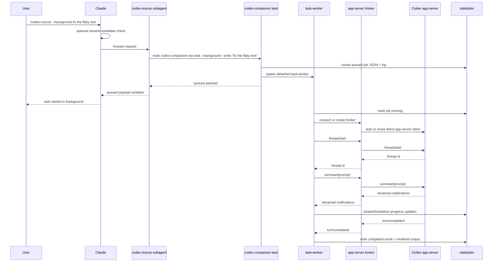
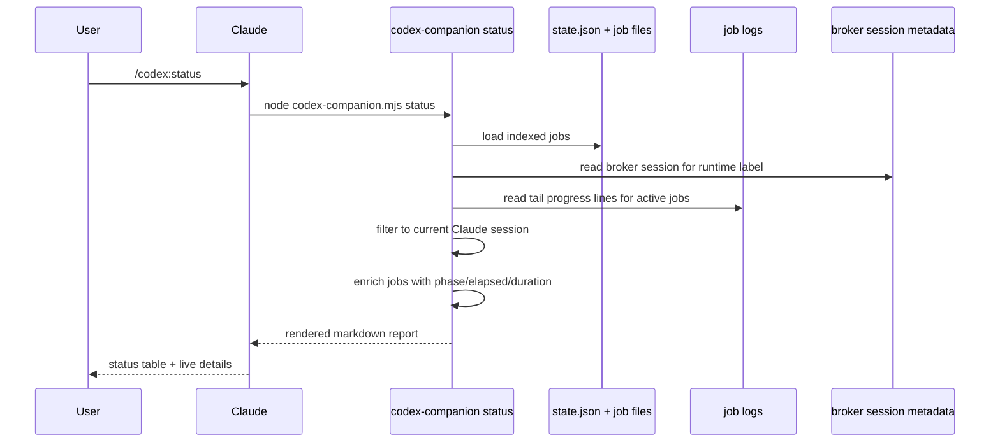
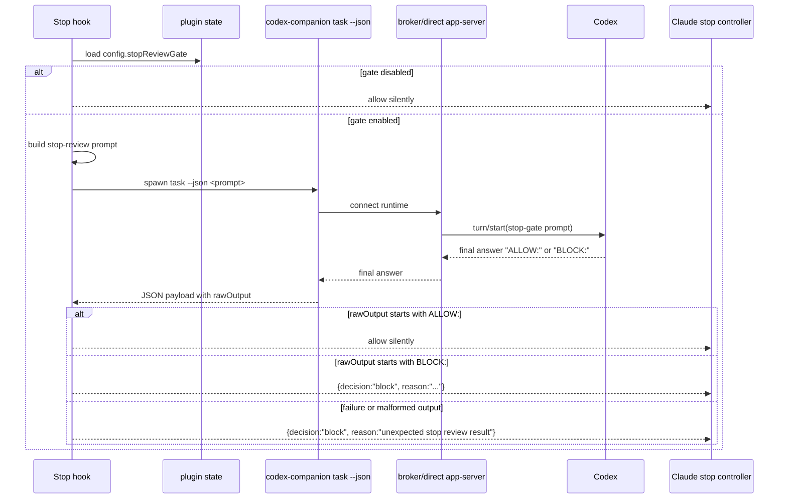
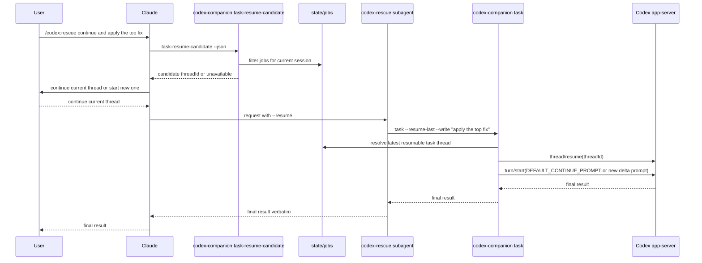

# Codex Claude Code Plugin Architecture Reference

Purpose: document the OpenAI Codex Claude Code plugin as a clean-room architectural contract for the `multi-cli-plugins` port. This file describes behavior, boundaries, data shapes, and execution flow. It does not authorize copying source code.

Source audited:
- `/home/brodey/.claude/plugins/marketplaces/openai-codex/plugins/codex/`
- `/home/brodey/.claude/plugins/marketplaces/openai-codex/.claude-plugin/marketplace.json`
- `/home/brodey/.claude/plugins/marketplaces/openai-codex/tests/`
- `/home/brodey/.claude/plugins/marketplaces/openai-codex/.github/workflows/`
- `/home/brodey/.claude/plugins/marketplaces/openai-codex/package.json`
- `/home/brodey/.claude/plugins/marketplaces/openai-codex/README.md`
- `/home/brodey/.claude/plugins/marketplaces/openai-codex/LICENSE`
- `/home/brodey/.claude/plugins/marketplaces/openai-codex/NOTICE`

Clean-room porting notes:
- Treat this plugin as a three-layer system: Claude-facing command surface, Node companion runtime, Codex app-server transport.
- The stable contract is behavior and data shape, not file-for-file implementation.
- The key design goal is reuse of one warmed Codex runtime per Claude session while keeping Claude command UX simple.
- The plugin is Apache-2.0 licensed. MIT ports must preserve the upstream attribution and must not copy code verbatim.

## 1. Top-level layout

Repository-level tree used for this reference:

```text
openai-codex/
├── .claude-plugin/
│   └── marketplace.json                  # Marketplace manifest for Claude Code
├── .github/
│   └── workflows/
│       └── pull-request-ci.yml           # PR CI: npm ci, install Codex CLI, test, build
├── LICENSE                               # Repository Apache-2.0 license
├── NOTICE                                # Repository attribution notice
├── README.md                             # User-facing install and usage docs
├── package.json                          # Build/test metadata and app-server type generation
├── plugins/
│   └── codex/
│       ├── .claude-plugin/
│       │   └── plugin.json               # Per-plugin manifest
│       ├── CHANGELOG.md                  # Release notes
│       ├── LICENSE                       # Plugin-level Apache-2.0 license copy
│       ├── NOTICE                        # Plugin-level attribution notice
│       ├── agents/
│       │   └── codex-rescue.md           # Claude subagent definition for rescue delegation
│       ├── commands/
│       │   ├── adversarial-review.md     # Steerable challenge review slash command
│       │   ├── cancel.md                 # Cancel active tracked job
│       │   ├── rescue.md                 # Delegate task to Codex subagent
│       │   ├── result.md                 # Show stored result payload
│       │   ├── review.md                 # Built-in Codex review command
│       │   ├── setup.md                  # Setup/auth/review-gate management
│       │   └── status.md                 # Job and runtime status command
│       ├── hooks/
│       │   └── hooks.json                # SessionStart, SessionEnd, Stop hook registration
│       ├── prompts/
│       │   ├── adversarial-review.md     # XML-style prompt template for challenge review
│       │   └── stop-review-gate.md       # XML-style prompt template for stop-time gate
│       ├── schemas/
│       │   └── review-output.schema.json # JSON schema for structured adversarial review output
│       ├── scripts/
│       │   ├── app-server-broker.mjs     # Shared runtime broker process
│       │   ├── codex-companion.mjs       # Main CLI entrypoint used by commands and hooks
│       │   ├── session-lifecycle-hook.mjs# Hook for env export and cleanup
│       │   ├── stop-review-gate-hook.mjs # Hook for stop-time review decision
│       │   └── lib/
│       │       ├── app-server-protocol.d.ts # Typed JSON-RPC method map
│       │       ├── app-server.mjs        # Codex app-server client and broker fallback logic
│       │       ├── args.mjs              # Argument parser and raw-string splitter
│       │       ├── broker-endpoint.mjs   # Socket/pipe endpoint creation and parsing
│       │       ├── broker-lifecycle.mjs  # Broker spawn, probe, persist, teardown
│       │       ├── codex.mjs             # High-level Codex operations over app-server
│       │       ├── fs.mjs                # Small filesystem helpers
│       │       ├── git.mjs               # Git diff target selection and review context assembly
│       │       ├── job-control.mjs       # Status snapshots, filtering, result lookup
│       │       ├── process.mjs           # Sync process exec and cross-platform termination
│       │       ├── prompts.mjs           # Prompt template loading and interpolation
│       │       ├── render.mjs            # Human-readable output rendering
│       │       ├── state.mjs             # Persistent state and job index storage
│       │       ├── tracked-jobs.mjs      # Job execution wrapper and progress logging
│       │       └── workspace.mjs         # Resolve repo root or fall back to cwd
│       └── skills/
│           ├── codex-cli-runtime/
│           │   └── SKILL.md              # Rescue subagent runtime contract
│           ├── codex-result-handling/
│           │   └── SKILL.md              # Presentation rules for Codex output
│           └── gpt-5-4-prompting/
│               ├── SKILL.md              # Prompt-shaping rules for Codex rescue runs
│               └── references/
│                   ├── codex-prompt-antipatterns.md # Prompt failure modes
│                   ├── codex-prompt-recipes.md      # Prompt templates
│                   └── prompt-blocks.md             # Reusable XML blocks
└── tests/
    ├── broker-endpoint.test.mjs          # Broker endpoint naming tests
    ├── commands.test.mjs                 # Slash command and hook contract tests
    ├── fake-codex-fixture.mjs            # Fake Codex runtime for integration tests
    ├── git.test.mjs                      # Review target and review context tests
    ├── helpers.mjs                       # Test helpers
    ├── process.test.mjs                  # Process termination tests
    ├── render.test.mjs                   # Output rendering tests
    ├── runtime.test.mjs                  # Companion runtime integration tests
    └── state.test.mjs                    # State directory and pruning tests
```

Layout observations:
- The marketplace repo contains one installable plugin named `codex`.
- The plugin itself is self-contained under `plugins/codex`.
- Claude-facing assets are markdown and JSON manifests.
- All executable logic is Node ESM under `scripts/`.
- The design uses tests as a contract harness, not just smoke coverage.

## 2. Plugin manifests

### `plugins/codex/.claude-plugin/plugin.json`

Current content:

```json
{
  "name": "codex",
  "version": "1.0.2",
  "description": "Use Codex from Claude Code to review code or delegate tasks.",
  "author": {
    "name": "OpenAI"
  }
}
```

Meaning of fields:
- `name`: install name and namespace root. Commands become `/codex:*`.
- `version`: plugin version surfaced to Claude and reused by runtime metadata.
- `description`: short marketplace and plugin catalog text.
- `author.name`: human attribution shown in plugin metadata.

How Claude likely uses it:
- Claude discovers plugin identity from directory placement plus `plugin.json`.
- `name` appears to drive namespacing for slash commands and agents.
- Runtime code reads this file again inside `lib/app-server.mjs` to stamp `clientInfo.version` when talking to the Codex app-server.

### `.claude-plugin/marketplace.json`

Current content shape:

```json
{
  "name": "openai-codex",
  "owner": { "name": "OpenAI" },
  "metadata": {
    "description": "Codex plugins to use in Claude Code for delegation and code review.",
    "version": "1.0.2"
  },
  "plugins": [
    {
      "name": "codex",
      "description": "Use Codex from Claude Code to review code or delegate tasks.",
      "version": "1.0.2",
      "author": { "name": "OpenAI" },
      "source": "./plugins/codex"
    }
  ]
}
```

Meaning of fields:
- `name`: marketplace identifier, used in install syntax like `codex@openai-codex`.
- `owner.name`: marketplace attribution.
- `metadata.description`: marketplace summary.
- `metadata.version`: marketplace package version.
- `plugins[]`: installable plugin entries.
- `plugins[].source`: relative path to the plugin root inside the marketplace repo.

Marketplace pattern worth porting:
- One repo can host one or more plugins.
- Marketplace metadata duplicates enough plugin summary fields for discovery without opening each plugin root.
- Plugin version is repeated in marketplace entry, plugin manifest, and package metadata. That duplication keeps runtime, marketplace, and docs aligned.

### `plugins/codex/hooks/hooks.json`

Current shape:

```json
{
  "description": "Optional stop-time review gate for Codex Companion.",
  "hooks": {
    "SessionStart": [{ "hooks": [{ "type": "command", "command": "...session-lifecycle-hook.mjs SessionStart", "timeout": 5 }] }],
    "SessionEnd":   [{ "hooks": [{ "type": "command", "command": "...session-lifecycle-hook.mjs SessionEnd",   "timeout": 5 }] }],
    "Stop":         [{ "hooks": [{ "type": "command", "command": "...stop-review-gate-hook.mjs",               "timeout": 900 }] }]
  }
}
```

Meaning of fields:
- Top-level `description`: human label for the hook pack.
- `hooks.SessionStart`: runs once when Claude starts the session.
- `hooks.SessionEnd`: runs once when Claude ends the session.
- `hooks.Stop`: runs on Claude stop attempts.
- Nested `type: "command"`: external process hook.
- `command`: shell command Claude executes. The plugin uses `${CLAUDE_PLUGIN_ROOT}` so hooks survive relocations.
- `timeout`: hard limit in seconds for hook runtime.

How Claude Code likely loads hooks:
- Claude scans `hooks/hooks.json` as part of plugin load.
- Hook commands receive JSON on stdin. The two hook scripts parse stdin as JSON.
- Session hooks are always registered, but behavior is partly gated by plugin state.
- The stop hook is present all the time, but it only blocks when `stopReviewGate` is enabled in plugin state.

Load model for the whole plugin:
- Manifest files declare identity.
- Markdown files under `commands/`, `agents/`, and `skills/` are Claude-readable control surfaces.
- Node scripts under `scripts/` act as the runtime backend.
- Hooks extend Claude lifecycle with setup, cleanup, and optional stop gating.

## 3. Slash commands

Command design pattern:
- User-facing command logic is mostly in markdown, not code.
- Each slash command either shells straight into `codex-companion.mjs` or routes to the `codex-rescue` subagent.
- The markdown command file controls user questioning, background behavior, and output handling.
- `codex-companion.mjs` is the stable backend entrypoint for every deterministic command.

### `/codex:review`

Trigger:
- Slash command file: `commands/review.md`
- Backend command: `node "${CLAUDE_PLUGIN_ROOT}/scripts/codex-companion.mjs" review "$ARGUMENTS"`

Purpose:
- Run the built-in Codex reviewer against local git state.
- Read-only only.
- No custom focus text allowed.

Argument contract:
- `--wait`
- `--background`
- `--base <ref>`
- `--scope auto|working-tree|branch`

Claude-side behavior:
- If `--wait` is present, run foreground.
- If `--background` is present, launch background Bash and stop.
- If neither is present, Claude estimates review size using git status and diff stat and asks one binary question:
  - `Wait for results`
  - `Run in background`
- The markdown command explicitly tells Claude not to strip the execution flags. The companion runtime parses them.

Backend behavior:
- `codex-companion.mjs` resolves the git review target.
- Native review only supports working tree or base branch review.
- If focus text is present, the command rejects it and points users to `/codex:adversarial-review`.
- Result is returned verbatim.

Expected user flow:
1. User runs `/codex:review`.
2. Claude decides foreground or background.
3. Companion resolves review target.
4. Companion starts a tracked review job.
5. If background, user follows with `/codex:status` and `/codex:result`.

### `/codex:adversarial-review`

Trigger:
- Slash command file: `commands/adversarial-review.md`
- Backend command: `node "${CLAUDE_PLUGIN_ROOT}/scripts/codex-companion.mjs" adversarial-review "$ARGUMENTS"`

Purpose:
- Run a steerable challenge review that questions design choices, tradeoffs, assumptions, and failure modes.

Argument contract:
- `--wait`
- `--background`
- `--base <ref>`
- `--scope auto|working-tree|branch`
- freeform focus text after flags

Claude-side behavior:
- Same foreground/background logic as `/codex:review`.
- Focus text is preserved exactly.
- Claude is told not to weaken the adversarial framing.

Backend behavior:
- For small diffs, the runtime inlines git diff context into the prompt.
- For larger diffs, the runtime sends a lightweight summary and tells Codex to inspect the diff itself.
- Output must conform to `schemas/review-output.schema.json`.
- Rendered result sorts findings by severity and includes reasoning sections when present.

Expected user flow:
1. User runs `/codex:adversarial-review --background look for race conditions`.
2. Claude backgrounds the run.
3. Companion stores the job and log.
4. User checks `/codex:status`.
5. User reads `/codex:result`.

### `/codex:rescue`

Trigger:
- Slash command file: `commands/rescue.md`
- Dispatch target: `codex:codex-rescue` subagent

Purpose:
- Hand investigation, implementation, planning, diagnosis, or follow-up work to Codex through a single forwarder subagent.

Argument contract:
- `--background|--wait`
- `--resume|--fresh`
- `--model <model|spark>`
- `--effort <none|minimal|low|medium|high|xhigh>`
- freeform task text

Claude-side behavior:
- Execution flags control Claude, not Codex prompt text.
- If `--resume` or `--fresh` is absent, Claude asks once whether to continue the current Codex thread or start a new one, but only when the helper reports a resumable thread for the current Claude session.
- If Codex is missing or unauthenticated, Claude tells the user to run `/codex:setup`.

Subagent-side behavior:
- The subagent is a thin wrapper around `codex-companion.mjs task`.
- It may tighten the prompt using the `gpt-5-4-prompting` skill.
- It must not inspect the repo or do follow-up work itself.

Expected user flow:
1. User runs `/codex:rescue fix the flaky test`.
2. Claude checks for resume candidate.
3. Claude asks continue vs fresh when relevant.
4. Subagent forwards one `task` invocation.
5. Companion runs foreground or background tracked task.

### `/codex:status`

Trigger:
- Slash command file: `commands/status.md`
- Backend command: `node "${CLAUDE_PLUGIN_ROOT}/scripts/codex-companion.mjs" status $ARGUMENTS`

Purpose:
- Show active and recent Codex jobs for the current repository and current Claude session by default.

Argument contract:
- `[job-id]`
- `--wait`
- `--timeout-ms <ms>`
- `--all`

Behavior:
- No job id: show a compact table for current-session jobs.
- With job id: show full detail for that job.
- `--wait` only works with a specific job id.
- Job matching supports exact id or unique prefix.

Expected user flow:
1. User backgrounds a review or rescue.
2. User runs `/codex:status`.
3. Companion reads persisted job index and logs.
4. Renderer prints table plus live detail blocks.

### `/codex:result`

Trigger:
- Slash command file: `commands/result.md`
- Backend command: `node "${CLAUDE_PLUGIN_ROOT}/scripts/codex-companion.mjs" result $ARGUMENTS`

Purpose:
- Show stored final output for a finished job.

Behavior:
- Full output only.
- No summarization.
- Includes session id and `codex resume <threadId>` when available.
- Prefers structured rendered output for adversarial review jobs.

Expected user flow:
1. User runs `/codex:result`.
2. Companion resolves latest finished job in current session unless a job id is passed.
3. Stored rendered or raw output is printed.

### `/codex:cancel`

Trigger:
- Slash command file: `commands/cancel.md`
- Backend command: `node "${CLAUDE_PLUGIN_ROOT}/scripts/codex-companion.mjs" cancel $ARGUMENTS`

Purpose:
- Stop an active background job.

Behavior:
- Resolves one active job.
- Attempts `turn/interrupt` against the Codex app-server if it has `threadId` and `turnId`.
- Then kills the process tree for the detached worker.
- Marks job state as `cancelled`.

Expected user flow:
1. User runs `/codex:cancel`.
2. Companion interrupts Codex turn when possible.
3. Companion kills local worker.
4. Job state and logs are updated.

### `/codex:setup`

Trigger:
- Slash command file: `commands/setup.md`
- Backend command: `node "${CLAUDE_PLUGIN_ROOT}/scripts/codex-companion.mjs" setup --json $ARGUMENTS`

Purpose:
- Check Node/npm/Codex/auth status.
- Toggle the optional stop-time review gate.

Argument contract:
- `--enable-review-gate`
- `--disable-review-gate`

Claude-side behavior:
- If Codex is missing and npm exists, Claude asks once whether to install Codex now.
- If user approves, Claude runs `npm install -g @openai/codex`, then reruns setup.

Backend behavior:
- Builds a report with environment checks, auth status, runtime mode, gate flag, and next steps.
- Persists `stopReviewGate` toggle into state.

Expected user flow:
1. User installs plugin.
2. User runs `/codex:setup`.
3. Claude may offer install.
4. Setup report explains next step, often `!codex login`.

## 4. Sub-skills

Skill loading model:
- These are internal skills, not user-invocable.
- They exist to constrain Claude and the `codex-rescue` subagent.
- They move policy from code into markdown so the same runtime can be steered without changing JS.

### `skills/codex-cli-runtime/SKILL.md`

When Claude reads it:
- Inside the `codex:codex-rescue` subagent only.

What it instructs Claude to do:
- Use exactly one runtime helper:
  - `node "${CLAUDE_PLUGIN_ROOT}/scripts/codex-companion.mjs" task "<raw arguments>"`
- Be a forwarder, not an orchestrator.
- Do not call setup, review, status, result, or cancel.
- Default to `--write` unless user asked for read-only, review, diagnosis, or research.
- Strip `--background` and `--wait` before invoking `task`.
- Map `spark` to `gpt-5.3-codex-spark`.
- Map `--resume` to `task --resume-last`.
- Treat `--fresh` as a forced fresh thread.
- Do not inspect the repo, poll status, or do follow-up work.
- If the Bash call fails, return nothing.

Porting insight:
- This skill is the policy layer that stops the subagent from competing with the runtime.
- The port should keep the rescue agent narrow or it will drift into duplicate orchestration logic.

### `skills/codex-result-handling/SKILL.md`

When Claude reads it:
- When presenting helper output back to the user.

What it instructs Claude to do:
- Preserve verdict, summary, findings, next steps, evidence boundaries, file paths, and line numbers.
- Keep review findings severity-ordered.
- If no findings exist, say that directly.
- If a rescue run failed, report failure and stop.
- If setup or auth is required, direct the user to `/codex:setup`.
- Critical policy: after a review, stop and ask which issues to fix; do not auto-apply changes from review output.

Porting insight:
- This skill keeps Claude from translating or smoothing away structured reviewer output.
- It also prevents review commands from turning into auto-fix commands.

### `skills/gpt-5-4-prompting/SKILL.md`

When Claude reads it:
- When the rescue subagent wants to shape a better Codex prompt before forwarding.

What it instructs Claude to do:
- Prompt Codex like an operator with compact XML blocks.
- State one clear task.
- Include output contract, follow-through defaults, verification loop, grounding rules, and safety tags when needed.
- Use `task` for diagnosis, planning, research, or implementation.
- Use `task --resume-last` for follow-up on the same thread.
- Tighten prompt contract before raising reasoning effort.

Supporting references:
- `references/prompt-blocks.md`
- `references/codex-prompt-recipes.md`
- `references/codex-prompt-antipatterns.md`

Porting insight:
- The skill makes prompt quality a config asset rather than a JS concern.
- Cursor and Gemini ports should keep the same idea even if prompt shape changes.

## 5. Agent definition

File:
- `agents/codex-rescue.md`

Frontmatter:
- `name: codex-rescue`
- `description: ...`
- `tools: Bash`
- `skills: [codex-cli-runtime, gpt-5-4-prompting]`

How it is invoked:
- Slash command `/codex:rescue` routes to `codex:codex-rescue`.
- The README also implies it may be used proactively when a user asks Claude to delegate to Codex.

What tools it gets:
- Only `Bash`.
- No direct repo search tools in the frontmatter.
- Behavior policy then narrows that Bash usage to one runtime call.

What the definition tells Claude:
- Use this subagent when the main Claude thread is stuck or needs a second pass.
- Prefer foreground for bounded work, background for open-ended work.
- Use only one `task` call.
- Strip routing flags from prompt text.
- Map `spark` alias.
- Default to write-capable runs unless the user wants read-only.
- Return command stdout exactly as-is.

Why this agent exists:
- It separates delegation UX from runtime execution.
- The main Claude thread handles user conversation and resume choice.
- The subagent handles only one outbound Codex task invocation.

## 6. Companion script

File:
- `scripts/codex-companion.mjs`

Role:
- Single backend CLI facade for commands, hooks, and tests.
- Owns job tracking, state writes, status rendering, task/background orchestration, and runtime invocation.

Subcommands:
- `setup`
- `review`
- `adversarial-review`
- `task`
- `task-worker`
- `status`
- `result`
- `task-resume-candidate`
- `cancel`

Module map by responsibility:

### CLI and argument normalization

Functions:
- `printUsage()`
- `normalizeArgv(argv)`
- `parseCommandInput(argv, config)`
- `resolveCommandCwd(options)`
- `resolveCommandWorkspace(options)`

Why they exist:
- Slash commands can arrive as one quoted `$ARGUMENTS` string or tokenized argv.
- The helper normalizes both into a stable parser path.
- Short alias `-C` maps to `--cwd`.

### Generic output helpers

Functions:
- `outputResult(value, asJson)`
- `outputCommandResult(payload, rendered, asJson)`
- `shorten(text, limit)`
- `firstMeaningfulLine(text, fallback)`

Why they exist:
- The same runtime serves human-readable slash commands and JSON-returning hooks/tests.
- Summaries are derived from first meaningful output lines for status tables.

### Setup flow

Functions:
- `buildSetupReport(cwd, actionsTaken)`
- `handleSetup(argv)`

Behavior:
- Checks `node`, `npm`, `codex --version`, `codex app-server --help`.
- Asks `lib/codex.mjs` for auth status through app-server APIs.
- Reads `stopReviewGate` config from persistent state.
- Writes config changes for `--enable-review-gate` or `--disable-review-gate`.
- Produces next steps like install or `!codex login`.

Why it matters:
- Setup is the health check entrypoint.
- It is also the only place where stop-gate toggling is user-facing.

### Review prompt assembly

Functions:
- `buildAdversarialReviewPrompt(context, focusText)`
- `ensureCodexAvailable(cwd)`
- `buildNativeReviewTarget(target)`
- `validateNativeReviewRequest(target, focusText)`

Behavior:
- Native review uses `review/start` with a compact target object.
- Adversarial review uses `turn/start` with a prompt template and JSON schema.
- `/codex:review` rejects focus text by design.

Why it matters:
- The plugin has two review modes with separate backend contracts.
- Ports should keep that split instead of forcing one review path to handle all cases.

### Session-scoped job lookup and resume

Functions:
- `getCurrentClaudeSessionId()`
- `filterJobsForCurrentClaudeSession(jobs)`
- `findLatestResumableTaskJob(jobs)`
- `waitForSingleJobSnapshot(cwd, reference, options)`
- `resolveLatestTrackedTaskThread(cwd, options)`
- `handleTaskResumeCandidate(argv)`

Behavior:
- Resume suggestions are scoped to the current Claude session when possible.
- Active jobs block resume selection.
- If no Claude session id exists, the helper can fall back to `findLatestTaskThread()` from the Codex app-server.

Why it matters:
- This keeps "continue last task" from accidentally attaching to unrelated work from another Claude session.

### Review execution

Functions:
- `executeReviewRun(request)`
- `handleReviewCommand(argv, config)`
- `handleReview(argv)`

Native review path:
- Resolve git target.
- Call `runAppServerReview()`.
- Store raw review text and reasoning summary.
- Render via `renderNativeReviewResult()`.

Adversarial review path:
- Collect review context with inline-diff or self-collect mode.
- Build XML prompt.
- Call `runAppServerTurn()` with `outputSchema`.
- Parse returned JSON with `parseStructuredOutput()`.
- Render via `renderReviewResult()`.

Why it matters:
- Review jobs are first-class tracked jobs, same as tasks.
- The only difference is job kind and renderer.

### Task execution

Functions:
- `executeTaskRun(request)`
- `buildTaskRunMetadata({ prompt, resumeLast })`
- `buildTaskJob(workspaceRoot, taskMetadata, write)`
- `buildTaskRequest(...)`
- `readTaskPrompt(cwd, options, positionals)`
- `requireTaskRequest(prompt, resumeLast)`
- `handleTask(argv)`
- `handleTaskWorker(argv)`

Foreground behavior:
- Create a task job.
- Run `executeTaskRun()` inside `runTrackedJob()`.
- Print rendered or JSON output.

Background behavior:
- Create a task job with status `queued`.
- Persist the original request in the job file.
- Spawn detached `task-worker`.
- Return queue confirmation immediately.

Resume behavior:
- `--resume` and `--resume-last` both map to resume semantics.
- `--fresh` blocks resume semantics.
- If resuming, runtime sends a default continuation prompt when no new prompt text is given.

Write behavior:
- `--write` flips Codex sandbox from `read-only` to `danger-full-access`.

Why it matters:
- The background worker pattern is the main long-running job pattern to port to Cursor and Gemini.

### Tracking, status, result, and cancel

Functions:
- `runForegroundCommand(job, runner, options)`
- `spawnDetachedTaskWorker(cwd, jobId)`
- `enqueueBackgroundTask(cwd, job, request)`
- `handleStatus(argv)`
- `handleResult(argv)`
- `handleCancel(argv)`

Status behavior:
- No id: status report scoped to current session.
- With id: detailed job block.
- Optional wait loop for one job.

Result behavior:
- Reads stored job payload from disk.
- Prefers rendered structured review output.
- Prints thread id and `codex resume <threadId>` when available.

Cancel behavior:
- Resolve active job.
- Ask app-server to interrupt turn when thread and turn ids are known.
- Kill detached worker process tree.
- Mark job as `cancelled`.

### Error handling pattern

Patterns used across the file:
- Throw JS `Error` with user-readable message for invalid flag combinations or missing prompt input.
- For foreground jobs, `runTrackedJob()` captures failure into job state and rethrows.
- `main()` prints the final error message to stderr and sets exit code `1`.
- `handleCancel()` is best effort on turn interrupt, then force-kills local worker anyway.

IPC and lifecycle summary:
- Commands call `codex-companion.mjs`.
- Companion calls app-server helper functions in `lib/codex.mjs`.
- `task-worker` is a detached child process used only for background tasks.
- Hooks also call the companion runtime or related library helpers.

## 7. App-server broker

Files:
- `scripts/app-server-broker.mjs`
- `scripts/lib/app-server.mjs`
- `scripts/lib/app-server-protocol.d.ts`
- `scripts/lib/broker-endpoint.mjs`
- `scripts/lib/broker-lifecycle.mjs`

### What Codex app-server is in this architecture

Observed role:
- The plugin does not shell out to `codex review` or `codex chat` commands for main work.
- It talks to `codex app-server`, a JSON-RPC-like long-lived process exposed through stdin/stdout when direct and through socket/pipe when brokered.
- App-server supports thread lifecycle, turn execution, review execution, interrupts, and config/account reads.

Methods present in `app-server-protocol.d.ts`:
- `initialize`
- `thread/start`
- `thread/resume`
- `thread/name/set`
- `thread/list`
- `review/start`
- `turn/start`
- `turn/interrupt`

Notifications consumed by the plugin:
- `thread/started`
- `thread/name/updated`
- `turn/started`
- `item/started`
- `item/completed`
- `turn/completed`
- `error`

### Why the broker exists

Problem:
- Starting `codex app-server` for every command wastes time and state.
- Long-running jobs and repeated `/codex:status`, `/codex:result`, `/codex:review`, and `/codex:rescue` runs benefit from a warm runtime.

Broker design:
- Start one shared broker process per Claude session and workspace.
- Broker owns one direct Codex app-server client.
- Individual companion commands connect to the broker over a Unix socket or Windows named pipe.
- Broker serializes access so two commands do not concurrently drive one Codex runtime.

### Broker endpoint contract

From `broker-endpoint.mjs`:
- Non-Windows endpoint: `unix:<sessionDir>/broker.sock`
- Windows endpoint: `pipe:\\.\pipe\<sanitized-session-name>-codex-app-server`

Reasons:
- Unix sockets are local-only and cheap.
- Windows named pipes match platform transport norms.
- Endpoint values are stored in broker session metadata and optionally exported to environment.

### Broker lifecycle

From `broker-lifecycle.mjs`:
- `createBrokerSessionDir()` creates a temp dir like `/tmp/cxc-*`.
- `spawnBrokerProcess()` runs `node scripts/app-server-broker.mjs serve --endpoint ... --cwd ... --pid-file ...` detached.
- `waitForBrokerEndpoint()` probes readiness.
- `saveBrokerSession()` persists broker metadata to `broker.json` under plugin state dir.
- `loadBrokerSession()` reloads persisted broker metadata.
- `sendBrokerShutdown()` sends JSON-RPC command `broker/shutdown`.
- `teardownBrokerSession()` removes pid file, log file, socket path, and session dir.

Broker session record shape:

```json
{
  "endpoint": "unix:/tmp/cxc-abc123/broker.sock",
  "pidFile": "/tmp/cxc-abc123/broker.pid",
  "logFile": "/tmp/cxc-abc123/broker.log",
  "sessionDir": "/tmp/cxc-abc123",
  "pid": 12345
}
```

### `lib/app-server.mjs` client model

Classes:
- `AppServerClientBase`
- `SpawnedCodexAppServerClient`
- `BrokerCodexAppServerClient`
- `CodexAppServerClient`

`AppServerClientBase` responsibilities:
- Maintain pending RPC map by id.
- Parse JSONL responses and notifications.
- Route server requests to a generic "unsupported" response.
- Track transport type.
- Hold accumulated stderr.

`SpawnedCodexAppServerClient` responsibilities:
- Spawn `codex app-server` directly.
- Bind stdout line reader and stderr capture.
- Send `initialize` and `initialized`.
- Close by ending stdin and killing process tree on Windows when needed.

`BrokerCodexAppServerClient` responsibilities:
- Connect to broker endpoint over socket/pipe.
- Send the same JSON-RPC messages as direct client.
- Close by ending socket.

`CodexAppServerClient.connect()` policy:
- Prefer broker unless `disableBroker` is true.
- Reuse endpoint from env or saved broker session.
- If no broker exists and reuse is not requested, create one lazily.
- Fall back to direct client when broker is disabled.

### Busy/broker fallback rules

Special code:
- `BROKER_BUSY_RPC_CODE = -32001`

Behavior in `lib/codex.mjs -> withAppServer()`:
- If broker returns busy, or env points to dead broker (`ENOENT`, `ECONNREFUSED`), retry once with a direct app-server client.
- This avoids total failure when the warm broker is busy or stale.

### Broker request handling

Main broker rules from `app-server-broker.mjs`:
- Only one active request socket and one active stream socket at a time.
- Streaming methods are:
  - `turn/start`
  - `review/start`
  - `thread/compact/start`
- While a stream is active, another client gets busy errors.
- Exception: `turn/interrupt` is allowed from another socket during an active stream if no active request is in flight.
- Broker replies to its own `initialize` locally with `{ userAgent: "codex-companion-broker" }`.
- It ignores notification-only `initialized`.
- It supports internal `broker/shutdown`.

Why that matters:
- The broker is not a full multiplexer.
- It is a single-runtime traffic cop with narrow interrupt support.
- Ports should keep the same constraint unless the target runtime supports true multiplexing.

## 8. Hook scripts

### `session-lifecycle-hook.mjs`

When it fires:
- `SessionStart`
- `SessionEnd`

Inputs:
- Hook JSON from stdin
- Event name from argv or hook payload

SessionStart behavior:
- Export `CODEX_COMPANION_SESSION_ID` into `CLAUDE_ENV_FILE`.
- Export `CLAUDE_PLUGIN_DATA` into `CLAUDE_ENV_FILE` if present.

Why:
- Later companion commands need session scoping and plugin data dir access even when run in separate processes.

SessionEnd behavior:
- Load broker session from state or environment.
- Send broker shutdown if endpoint exists.
- Clean up jobs belonging to the ending Claude session.
- For running or queued jobs in that session, try `terminateProcessTree(job.pid)`.
- Remove those jobs from persisted state.
- Tear down broker artifacts.
- Clear stored broker session metadata.

What it allows or blocks:
- It does not block Claude stop or end directly.
- It is cleanup only.

Exit codes:
- `0` on success.
- `1` if top-level exception escapes `main()`.

### `stop-review-gate-hook.mjs`

When it fires:
- `Stop` hook

Inputs:
- Hook JSON from stdin, especially:
  - `cwd`
  - `session_id`
  - `last_assistant_message`

Decision logic:
1. Resolve workspace and load plugin config.
2. Read jobs for current Claude session.
3. Build a warning note if any Codex job is still running.
4. If `stopReviewGate` is disabled:
   - log the running-task note to stderr
   - allow stop by returning nothing
5. If Codex is unavailable:
   - log setup note and running-task note to stderr
   - allow stop by returning nothing
6. If gate is enabled and Codex is available:
   - run `node codex-companion.mjs task --json <stop-review-prompt>`
   - parse returned JSON
   - inspect `rawOutput`
   - `ALLOW:` means stop can continue
   - `BLOCK:` means emit `{ "decision": "block", "reason": "..." }`

Prompt scope:
- Review only the previous Claude turn.
- Only block when that turn made direct edits.
- Ignore pure status, setup, or reporting turns.

Timeout:
- 15 minutes hard timeout for the stop review child process.

What it inspects:
- Plugin config state
- Current-session jobs
- Last assistant message
- Codex availability
- Output of a dedicated stop-gate task run

What it allows or blocks:
- Allows stop silently when gate is off.
- Allows stop silently when Codex is unavailable.
- Blocks only on a valid `BLOCK:` stop-gate verdict or malformed/failed stop review execution.

Exit codes:
- Usually `0`, even for block decisions, because block is communicated through JSON on stdout.
- `1` only for uncaught top-level errors.

## 9. Library modules

### `lib/app-server-protocol.d.ts`

Responsibility:
- Define the typed method map and transport payload types for the Codex app-server API.

Key exports:
- `ThreadStartParams`
- `ThreadResumeParams`
- `CodexAppServerClientOptions`
- `AppServerMethodMap`
- `AppServerMethod`
- `AppServerRequestParams`
- `AppServerResponse`
- `AppServerNotification`
- `AppServerNotificationHandler`

Dependencies:
- Generated TS types under `.generated/app-server-types`

### `lib/app-server.mjs`

Responsibility:
- Provide JSON-RPC client implementations for direct and brokered Codex app-server communication.

Key exports:
- `BROKER_ENDPOINT_ENV`
- `BROKER_BUSY_RPC_CODE`
- `CodexAppServerClient`

Dependencies:
- `broker-endpoint.mjs`
- `broker-lifecycle.mjs`
- `process.mjs`
- plugin manifest for version stamping

### `lib/args.mjs`

Responsibility:
- Parse CLI flags and split quoted raw argument strings.

Key exports:
- `parseArgs(argv, config)`
- `splitRawArgumentString(raw)`

Dependencies:
- none

Porting note:
- This raw splitter exists because Claude may pass `$ARGUMENTS` as one string.

### `lib/broker-endpoint.mjs`

Responsibility:
- Create and parse broker endpoint strings across Unix and Windows.

Key exports:
- `createBrokerEndpoint(sessionDir, platform)`
- `parseBrokerEndpoint(endpoint)`

Dependencies:
- Node `path` and `process`

### `lib/broker-lifecycle.mjs`

Responsibility:
- Start, persist, probe, shut down, and tear down the shared broker process.

Key exports:
- `PID_FILE_ENV`
- `LOG_FILE_ENV`
- `createBrokerSessionDir()`
- `waitForBrokerEndpoint()`
- `sendBrokerShutdown()`
- `spawnBrokerProcess()`
- `loadBrokerSession()`
- `saveBrokerSession()`
- `clearBrokerSession()`
- `ensureBrokerSession()`
- `teardownBrokerSession()`

Dependencies:
- `broker-endpoint.mjs`
- `state.mjs`

### `lib/codex.mjs`

Responsibility:
- High-level Codex runtime adapter over app-server.
- Own thread start/resume, turn capture, review execution, auth status, and structured output parsing.

Key exports:
- `getCodexAvailability(cwd)`
- `getSessionRuntimeStatus(env, cwd)`
- `getCodexAuthStatus(cwd, options)`
- `interruptAppServerTurn(cwd, { threadId, turnId })`
- `runAppServerReview(cwd, options)`
- `runAppServerTurn(cwd, options)`
- `findLatestTaskThread(cwd)`
- `buildPersistentTaskThreadName(prompt)`
- `parseStructuredOutput(rawOutput, fallback)`
- `readOutputSchema(schemaPath)`
- `DEFAULT_CONTINUE_PROMPT`
- `TASK_THREAD_PREFIX`

Dependencies:
- `app-server.mjs`
- `broker-lifecycle.mjs`
- `fs.mjs`
- `process.mjs`

### `lib/fs.mjs`

Responsibility:
- Tiny synchronous filesystem helpers.

Key exports:
- `ensureAbsolutePath(cwd, maybePath)`
- `createTempDir(prefix)`
- `readJsonFile(filePath)`
- `writeJsonFile(filePath, value)`
- `safeReadFile(filePath)`
- `isProbablyText(buffer)`
- `readStdinIfPiped()`

Dependencies:
- Node `fs`, `os`, `path`

### `lib/git.mjs`

Responsibility:
- Pick review target and assemble review evidence context.

Key exports:
- `ensureGitRepository(cwd)`
- `getRepoRoot(cwd)`
- `detectDefaultBranch(cwd)`
- `getCurrentBranch(cwd)`
- `getWorkingTreeState(cwd)`
- `resolveReviewTarget(cwd, options)`
- `collectReviewContext(cwd, target, options)`

Dependencies:
- `fs.mjs`
- `process.mjs`

Porting note:
- This module is the review scope brain.
- It decides inline diff vs self-collect based on file count and byte budget.

### `lib/job-control.mjs`

Responsibility:
- Build status/result/cancel snapshots from persisted job state.

Key exports:
- `DEFAULT_MAX_STATUS_JOBS`
- `DEFAULT_MAX_PROGRESS_LINES`
- `sortJobsNewestFirst(jobs)`
- `readJobProgressPreview(logFile, maxLines)`
- `enrichJob(job, options)`
- `readStoredJob(workspaceRoot, jobId)`
- `buildStatusSnapshot(cwd, options)`
- `buildSingleJobSnapshot(cwd, reference, options)`
- `resolveResultJob(cwd, reference)`
- `resolveCancelableJob(cwd, reference, options)`

Dependencies:
- `codex.mjs`
- `state.mjs`
- `tracked-jobs.mjs`
- `workspace.mjs`

### `lib/process.mjs`

Responsibility:
- Sync command execution and cross-platform process termination.

Key exports:
- `runCommand(command, args, options)`
- `runCommandChecked(command, args, options)`
- `binaryAvailable(command, versionArgs, options)`
- `terminateProcessTree(pid, options)`
- `formatCommandFailure(result)`

Dependencies:
- Node `child_process`
- Node `process`

### `lib/prompts.mjs`

Responsibility:
- Load markdown prompt templates and interpolate `{{TOKEN}}` variables.

Key exports:
- `loadPromptTemplate(rootDir, name)`
- `interpolateTemplate(template, variables)`

Dependencies:
- Node `fs`, `path`

### `lib/render.mjs`

Responsibility:
- Convert structured payloads and job snapshots into user-facing markdown or plain output.

Key exports:
- `renderSetupReport(report)`
- `renderReviewResult(parsedResult, meta)`
- `renderNativeReviewResult(result, meta)`
- `renderTaskResult(parsedResult, meta)`
- `renderStatusReport(report)`
- `renderJobStatusReport(job)`
- `renderStoredJobResult(job, storedJob)`
- `renderCancelReport(job)`

Dependencies:
- none beyond local helper functions

### `lib/state.mjs`

Responsibility:
- Resolve persistent state path and read/write state and job files.

Key exports:
- `resolveStateDir(cwd)`
- `resolveStateFile(cwd)`
- `resolveJobsDir(cwd)`
- `ensureStateDir(cwd)`
- `loadState(cwd)`
- `saveState(cwd, state)`
- `updateState(cwd, mutate)`
- `generateJobId(prefix)`
- `upsertJob(cwd, jobPatch)`
- `listJobs(cwd)`
- `setConfig(cwd, key, value)`
- `getConfig(cwd)`
- `writeJobFile(cwd, jobId, payload)`
- `readJobFile(jobFile)`
- `resolveJobLogFile(cwd, jobId)`
- `resolveJobFile(cwd, jobId)`

Dependencies:
- `workspace.mjs`
- Node crypto, fs, os, path

### `lib/tracked-jobs.mjs`

Responsibility:
- Wrap a long-running execution in state writes and log writes.

Key exports:
- `SESSION_ID_ENV`
- `nowIso()`
- `appendLogLine(logFile, message)`
- `appendLogBlock(logFile, title, body)`
- `createJobLogFile(workspaceRoot, jobId, title)`
- `createJobRecord(base, options)`
- `createJobProgressUpdater(workspaceRoot, jobId)`
- `createProgressReporter(options)`
- `runTrackedJob(job, runner, options)`

Dependencies:
- `state.mjs`

### `lib/workspace.mjs`

Responsibility:
- Resolve logical workspace root.

Key exports:
- `resolveWorkspaceRoot(cwd)`

Behavior:
- Returns git repo root when inside a repo.
- Falls back to raw cwd when not in a repo.

Dependency:
- `git.mjs`

## 10. State schema

State storage root rule:
- `resolveStateDir(cwd)` first resolves workspace root.
- It canonicalizes with `realpath` when possible.
- It builds a slug from repo basename.
- It hashes the canonical workspace path with SHA-256 and keeps the first 16 hex chars.
- If `CLAUDE_PLUGIN_DATA` exists, state root is `${CLAUDE_PLUGIN_DATA}/state`.
- Otherwise fallback root is `${os.tmpdir()}/codex-companion`.

Resulting workspace state dir shape:

```text
<state-root>/
└── <slug>-<16hex>/
    ├── state.json
    ├── broker.json
    └── jobs/
        ├── <job-id>.json
        └── <job-id>.log
```

### `state.json`

Top-level shape:

```json
{
  "version": 1,
  "config": {
    "stopReviewGate": false
  },
  "jobs": []
}
```

Semantics:
- `version`: schema version for the index file.
- `config.stopReviewGate`: feature flag for stop-time review blocking.
- `jobs`: up to 50 most recently updated job index entries.

Job index entry observed fields:
- `id`
- `kind`
- `kindLabel`
- `title`
- `workspaceRoot`
- `jobClass`
- `summary`
- `write`
- `sessionId`
- `createdAt`
- `updatedAt`
- `status`
- `startedAt`
- `phase`
- `pid`
- `logFile`
- `request`
- `threadId`
- `turnId`
- `completedAt`
- `errorMessage`

Observed status values:
- `queued`
- `running`
- `completed`
- `failed`
- `cancelled`

Observed phase values:
- `queued`
- `starting`
- `reviewing`
- `investigating`
- `running`
- `verifying`
- `editing`
- `finalizing`
- `done`
- `failed`
- `cancelled`

Retention rule:
- Only 50 jobs are kept in the index.
- Dropped jobs have their job JSON and log file deleted.

### `broker.json`

Shape:

```json
{
  "endpoint": "unix:/tmp/cxc-abc123/broker.sock",
  "pidFile": "/tmp/cxc-abc123/broker.pid",
  "logFile": "/tmp/cxc-abc123/broker.log",
  "sessionDir": "/tmp/cxc-abc123",
  "pid": 12345
}
```

Meaning:
- Persisted handle to the warm broker for this workspace.
- Read by lifecycle hooks and runtime connect logic.

### `jobs/<job-id>.json`

Queued background task example:

```json
{
  "id": "task-mabc12-xyz789",
  "kind": "task",
  "kindLabel": "rescue",
  "title": "Codex Task",
  "workspaceRoot": "/repo",
  "jobClass": "task",
  "summary": "fix the flaky test",
  "write": true,
  "sessionId": "claude-session-123",
  "createdAt": "2026-05-07T12:00:00.000Z",
  "status": "queued",
  "phase": "queued",
  "pid": 12345,
  "logFile": "/state/jobs/task-mabc12-xyz789.log",
  "request": {
    "cwd": "/repo",
    "model": null,
    "effort": null,
    "prompt": "fix the flaky test",
    "write": true,
    "resumeLast": false,
    "jobId": "task-mabc12-xyz789"
  }
}
```

Running/completed task adds:
- `startedAt`
- `threadId`
- `turnId`
- `completedAt`
- `result`
- `rendered`

Completed task result payload shape:

```json
{
  "status": 0,
  "threadId": "thread_123",
  "rawOutput": "final Codex reply text",
  "touchedFiles": ["src/a.ts", "src/b.ts"],
  "reasoningSummary": ["checked failing path", "ran tests after patch"]
}
```

Completed review payload shape, native:

```json
{
  "review": "Review",
  "target": {
    "mode": "working-tree",
    "label": "working tree diff",
    "explicit": false
  },
  "threadId": "thread_123",
  "sourceThreadId": "thread_123",
  "codex": {
    "status": 0,
    "stderr": "",
    "stdout": "review text",
    "reasoning": []
  }
}
```

Completed review payload shape, adversarial:

```json
{
  "review": "Adversarial Review",
  "target": {
    "mode": "branch",
    "label": "branch diff against main",
    "baseRef": "main",
    "explicit": true
  },
  "threadId": "thread_123",
  "context": {
    "repoRoot": "/repo",
    "branch": "feature-x",
    "summary": "Reviewing branch feature-x against main from merge-base abc123."
  },
  "codex": {
    "status": 0,
    "stderr": "",
    "stdout": "{\"verdict\":\"needs-attention\",...}",
    "reasoning": []
  },
  "result": {
    "verdict": "needs-attention",
    "summary": "...",
    "findings": [],
    "next_steps": []
  },
  "rawOutput": "{\"verdict\":\"needs-attention\",...}",
  "parseError": null,
  "reasoningSummary": []
}
```

### `jobs/<job-id>.log`

Format:
- Timestamped lines like `[2026-05-07T12:00:00.000Z] Starting Codex Task.`
- Progress lines from tool activity and phase changes.
- Named blocks appended for:
  - `Assistant message`
  - `Subagent <name> message`
  - `Reasoning summary`
  - `Subagent <name> reasoning summary`
  - `Review output`
  - `Final output`

### Lifecycle of one `job_id`

1. `generateJobId(prefix)` creates id like `task-<base36time>-<rand>`.
2. `createJobRecord()` stamps `createdAt` and current Claude `sessionId`.
3. For foreground runs:
   - `runTrackedJob()` writes job JSON with `status: running`
   - index entry is upserted
4. For background task runs:
   - companion writes queued job record with `request`
   - detached worker later reopens the same record
5. Progress updates add `phase`, `threadId`, `turnId` into both index and stored job file.
6. Completion writes:
   - `status: completed` or `failed`
   - `phase: done` or `failed`
   - `completedAt`
   - `result`
   - `rendered`
7. Cancel writes:
   - `status: cancelled`
   - `phase: cancelled`
   - `completedAt`
   - `cancelledAt`
   - `errorMessage: "Cancelled by user."`
8. State pruning may later delete the job if it falls out of the newest 50.
9. Session end may delete the job early if it belongs to the closing Claude session.

## 11. Prompts

Prompt strategy:
- Prompt templates live as markdown under `prompts/`.
- Runtime injects them only for adversarial review and stop-time gate review.
- Native review does not use these templates because it calls `review/start` directly.

### `prompts/adversarial-review.md`

Injected when:
- `codex-companion.mjs adversarial-review`
- Specifically in `buildAdversarialReviewPrompt()`

Full text:

```md
<role>
You are Codex performing an adversarial software review.
Your job is to break confidence in the change, not to validate it.
</role>

<task>
Review the provided repository context as if you are trying to find the strongest reasons this change should not ship yet.
Target: {{TARGET_LABEL}}
User focus: {{USER_FOCUS}}
</task>

<operating_stance>
Default to skepticism.
Assume the change can fail in subtle, high-cost, or user-visible ways until the evidence says otherwise.
Do not give credit for good intent, partial fixes, or likely follow-up work.
If something only works on the happy path, treat that as a real weakness.
</operating_stance>

<attack_surface>
Prioritize the kinds of failures that are expensive, dangerous, or hard to detect:
- auth, permissions, tenant isolation, and trust boundaries
- data loss, corruption, duplication, and irreversible state changes
- rollback safety, retries, partial failure, and idempotency gaps
- race conditions, ordering assumptions, stale state, and re-entrancy
- empty-state, null, timeout, and degraded dependency behavior
- version skew, schema drift, migration hazards, and compatibility regressions
- observability gaps that would hide failure or make recovery harder
</attack_surface>

<review_method>
Actively try to disprove the change.
Look for violated invariants, missing guards, unhandled failure paths, and assumptions that stop being true under stress.
Trace how bad inputs, retries, concurrent actions, or partially completed operations move through the code.
If the user supplied a focus area, weight it heavily, but still report any other material issue you can defend.
{{REVIEW_COLLECTION_GUIDANCE}}
</review_method>

<finding_bar>
Report only material findings.
Do not include style feedback, naming feedback, low-value cleanup, or speculative concerns without evidence.
A finding should answer:
1. What can go wrong?
2. Why is this code path vulnerable?
3. What is the likely impact?
4. What concrete change would reduce the risk?
</finding_bar>

<structured_output_contract>
Return only valid JSON matching the provided schema.
Keep the output compact and specific.
Use `needs-attention` if there is any material risk worth blocking on.
Use `approve` only if you cannot support any substantive adversarial finding from the provided context.
Every finding must include:
- the affected file
- `line_start` and `line_end`
- a confidence score from 0 to 1
- a concrete recommendation
Write the summary like a terse ship/no-ship assessment, not a neutral recap.
</structured_output_contract>

<grounding_rules>
Be aggressive, but stay grounded.
Every finding must be defensible from the provided repository context or tool outputs.
Do not invent files, lines, code paths, incidents, attack chains, or runtime behavior you cannot support.
If a conclusion depends on an inference, state that explicitly in the finding body and keep the confidence honest.
</grounding_rules>

<calibration_rules>
Prefer one strong finding over several weak ones.
Do not dilute serious issues with filler.
If the change looks safe, say so directly and return no findings.
</calibration_rules>

<final_check>
Before finalizing, check that each finding is:
- adversarial rather than stylistic
- tied to a concrete code location
- plausible under a real failure scenario
- actionable for an engineer fixing the issue
</final_check>

<repository_context>
{{REVIEW_INPUT}}
</repository_context>
```

Key purpose of each variable:
- `{{TARGET_LABEL}}`: human-readable review target like working tree or branch diff.
- `{{USER_FOCUS}}`: optional user steering.
- `{{REVIEW_COLLECTION_GUIDANCE}}`: tells Codex whether context is inline diff or lightweight summary.
- `{{REVIEW_INPUT}}`: actual git evidence.

### `prompts/stop-review-gate.md`

Injected when:
- `stop-review-gate-hook.mjs` calls `codex-companion.mjs task --json <prompt>`

Full text:

```md
<task>
Run a stop-gate review of the previous Claude turn.
Only review the work from the previous Claude turn.
Only review it if Claude actually did code changes in that turn.
Pure status, setup, or reporting output does not count as reviewable work.
For example, the output of /codex:setup or /codex:status does not count.
Only direct edits made in that specific turn count.
If the previous Claude turn was only a status update, a summary, a setup/login check, a review result, or output from a command that did not itself make direct edits in that turn, return ALLOW immediately and do no further work.
Challenge whether that specific work and its design choices should ship.

{{CLAUDE_RESPONSE_BLOCK}}
</task>

<compact_output_contract>
Return a compact final answer.
Your first line must be exactly one of:
- ALLOW: <short reason>
- BLOCK: <short reason>
Do not put anything before that first line.
</compact_output_contract>

<default_follow_through_policy>
Use ALLOW if the previous turn did not make code changes or if you do not see a blocking issue.
Use ALLOW immediately, without extra investigation, if the previous turn was not an edit-producing turn.
Use BLOCK only if the previous turn made code changes and you found something that still needs to be fixed before stopping.
</default_follow_through_policy>

<grounding_rules>
Ground every blocking claim in the repository context or tool outputs you inspected during this run.
Do not treat the previous Claude response as proof that code changes happened; verify that from the repository state before you block.
Do not block based on older edits from earlier turns when the immediately previous turn did not itself make direct edits.
</grounding_rules>

<dig_deeper_nudge>
If the previous turn did make code changes, check for second-order failures, empty-state behavior, retries, stale state, rollback risk, and design tradeoffs before you finalize.
</dig_deeper_nudge>
```

Purpose:
- This is a narrow review gate prompt, not a generic review prompt.
- It exists to stop recursive review loops over non-edit turns.

## 12. Schemas

File:
- `schemas/review-output.schema.json`

Purpose:
- Force adversarial review output into stable machine-readable JSON.
- Support rendering, storage, tests, and later result retrieval.
- Prevent prompt drift from breaking slash command UX.

Required top-level fields:
- `verdict`
- `summary`
- `findings`
- `next_steps`

Top-level constraints:
- object only
- `additionalProperties: false`

`verdict`:
- string
- enum:
  - `approve`
  - `needs-attention`

`summary`:
- non-empty string

`findings`:
- array of objects
- each item has `additionalProperties: false`
- each item requires:
  - `severity`
  - `title`
  - `body`
  - `file`
  - `line_start`
  - `line_end`
  - `confidence`
  - `recommendation`

Finding field constraints:
- `severity`: `critical | high | medium | low`
- `title`: non-empty string
- `body`: non-empty string
- `file`: non-empty string
- `line_start`: integer >= 1
- `line_end`: integer >= 1
- `confidence`: number in `[0,1]`
- `recommendation`: string

`next_steps`:
- array of non-empty strings

Why the schema exists:
- Adversarial review uses `turn/start`, not a dedicated review endpoint.
- That means output shape must be enforced from the client side.
- The renderer depends on this structure to sort findings and show file:line references.
- Tests cover malformed output paths, so the schema is part of the API contract.

## 13. Dataflow sequence diagrams

### A. `/codex:rescue --background` end-to-end



### B. `/codex:status` flow



### C. Stop hook review-gate flow



### D. Resume flow



## 14. Tests structure

### `tests/broker-endpoint.test.mjs`

Covers endpoint naming only. It verifies that Unix platforms use `unix:` socket endpoints and Windows uses `pipe:` named pipes. This locks down cross-platform broker addressing without needing the full runtime.

### `tests/commands.test.mjs`

Covers the markdown-facing contract. It checks that review and adversarial-review commands ask one binary question and keep review-only rules, that rescue absorbs continue semantics instead of exposing a separate command, that result and cancel stay deterministic runtime entrypoints, that hook wiring stays enabled, and that setup still points users toward Codex install and `codex login`.

### `tests/fake-codex-fixture.mjs`

Provides a fake Codex executable and fake app-server behavior for runtime tests. This is the test double that lets the suite exercise thread start, review, turn execution, notifications, auth variants, and background jobs without depending on the real Codex backend.

### `tests/git.test.mjs`

Covers review target resolution and context assembly. It tests dirty working tree preference, branch fallback, explicit base override, missing default branch failure, inline diff behavior for small reviews, lightweight self-collect fallback for large reviews, and safe handling for untracked directories and broken symlinks.

### `tests/helpers.mjs`

Small shared utilities for test setup. It exists to keep fixture setup and filesystem plumbing out of the main runtime tests.

### `tests/process.test.mjs`

Covers `terminateProcessTree()` behavior on Windows. It checks the `taskkill` path and the "already stopped" path so cancel and teardown logic do not treat missing processes as fatal.

### `tests/render.test.mjs`

Covers rendering edge cases. It verifies that malformed review JSON degrades into a readable error report and that stored structured review results prefer pre-rendered output when available.

### `tests/runtime.test.mjs`

This is the core integration contract suite. It covers setup readiness for several auth/provider states, native review output, adversarial review output, reasoning capture, thread resume, session-scoped resume candidate lookup, background task queueing, cancel behavior, session cleanup, stop-gate behavior, broker lazy start and reuse, and status/result output semantics. If you port only one test file’s intent, port this one.

### `tests/state.test.mjs`

Covers workspace state path derivation and job retention. It verifies temp-root fallback, `CLAUDE_PLUGIN_DATA` override, and pruning of dropped job artifacts when the index exceeds the job cap.

## 15. CI

File:
- `.github/workflows/pull-request-ci.yml`

What CI does on PR:
- Trigger: every `pull_request`
- Permissions: read-only repository contents
- Runner: `ubuntu-latest`
- Timeout: 10 minutes

Steps:
1. Check out repository with pinned `actions/checkout`.
2. Set up Node 22 with pinned `actions/setup-node` and npm cache.
3. Run `npm ci`.
4. Install the real Codex CLI globally with `npm install -g @openai/codex`.
5. Run `npm test`.
6. Run `npm run build`.

Why it matters:
- Tests run against a real installed `codex` binary path, not only mocks.
- Build step proves that app-server TS type generation and TS compile remain healthy.
- A Cursor or Gemini port should keep the same split: install target CLI, run tests, run build.

## 16. License + NOTICE

Repository and plugin license:
- Both root and plugin copies are Apache License 2.0.
- `package.json` also declares `"license": "Apache-2.0"`.

What the clean-room MIT port must preserve:
- Do not copy upstream implementation code.
- Preserve attribution to OpenAI for the source architecture you studied.
- Keep the upstream NOTICE text somewhere appropriate in project docs or notices if any upstream-derived material remains.
- If any actual upstream files are redistributed, keep the full Apache-2.0 LICENSE and NOTICE with them.

Verbatim NOTICE text from both root and plugin copies:

```text
Copyright 2026 OpenAI

Licensed under the Apache License, Version 2.0 (the "License");
you may not use this file except in compliance with the License.
You may obtain a copy of the License at

    http://www.apache.org/licenses/LICENSE-2.0

Unless required by applicable law or agreed to in writing, software
distributed under the License is distributed on an "AS IS" BASIS,
WITHOUT WARRANTIES OR CONDITIONS OF ANY KIND, either express or implied.
See the License for the specific language governing permissions and
limitations under the License.
```

Practical porting recommendation:
- For a clean-room reimplementation, keep an architecture note saying the port was informed by behavior and file structure of the OpenAI Codex Claude Code plugin.
- If no code is copied, MIT can cover the new implementation, but attribution should still stay in project history and docs.

## Replication checklist

- Keep plugin policy in markdown where Claude reads it.
- Keep execution backend in one stable CLI runtime entrypoint.
- Keep a tracked-job store with separate index, per-job payload, and log file.
- Keep a warm shared runtime broker per Claude session.
- Keep review and task as separate backend flows.
- Keep stop-time review gate optional and state-backed.
- Keep resume semantics session-scoped by default.
- Keep result rendering deterministic and recoverable from stored payloads.
- Keep tests around resume, broker reuse, gate behavior, and state pruning.

## Architectural summary

- Claude-facing surface:
  - slash command markdown
  - subagent markdown
  - skill markdown
  - hook manifest
- Runtime surface:
  - `codex-companion.mjs`
  - hook scripts
  - broker process
- Domain modules:
  - app-server transport
  - git review targeting
  - state and tracked jobs
  - result rendering
- Persistence:
  - workspace-scoped state dir
  - `state.json`
  - `broker.json`
  - `jobs/<id>.json`
  - `jobs/<id>.log`
- Test contract:
  - command docs
  - runtime behavior
  - broker behavior
  - state retention
  - render degradation

Final clean-room takeaway:
- The plugin is not "just slash commands around a CLI."
- It is a session-aware orchestration layer that wraps a long-lived Codex app-server, tracks long jobs on disk, and uses Claude markdown assets to keep policy editable outside the JS runtime.

Total file count analyzed: 56 files, 10451 LOC analyzed
